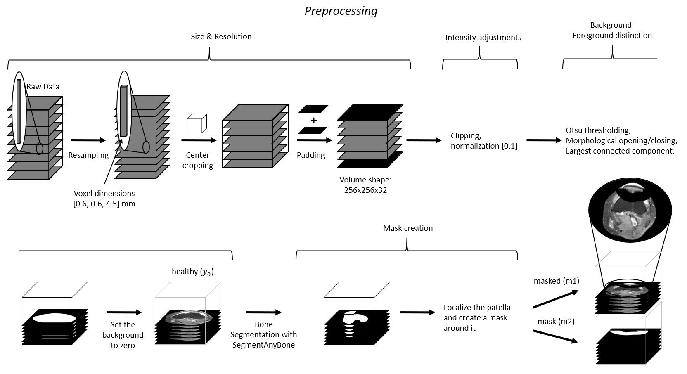
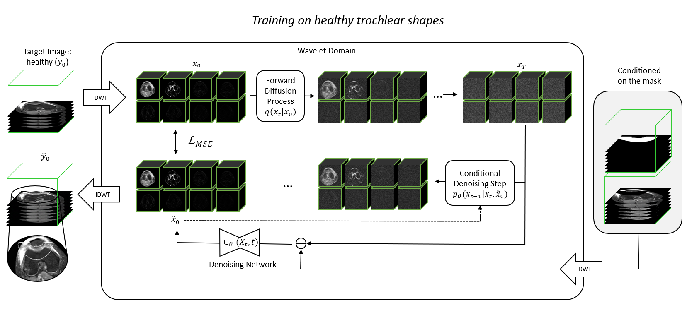
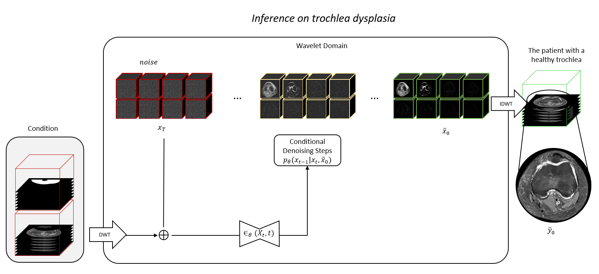

# Generating 3D Pseudo-Healthy Knee-MR Images to Support Trochleoplasty Planning


[](https://creativecommons.org/licenses/by-nc/4.0/)
[](https://wehrlimi.github.io/gen3d-ph-kneemri/)
[](https://arxiv.org/abs/2412.09962)


This is the official repository for the Paper "Generating 3D Pseudo-Healthy Knee-MR Images to Support Trochleoplasty Planning" by Wehrli et al., early accepted at [IPCAI2025](https://sites.google.com/view/ipcai2025). Check out our [Project Page](https://wehrlimi.github.io/gen3d-ph-kneemri/).
It builds on the work of Durrer et al. [1] ([DM Inpainting](https://github.com/AliciaDurrer/DM_Inpainting/tree/main)) and Friedrich et al. [2] ([WDM-3D](https://github.com/pfriedri/wdm-3d)). Our proposed method generates pseudo-healthy MR images that
restore the trochlea's shape to fit the patient’s unique patella, utilizing segmentation from Gu et al. [3] in a preprocessing step (for this repo see also here: [SegmentAnyBone](https://github.com/mazurowski-lab/SegmentAnyBone?tab=readme-ov-file)).
Following the methodology of Durrer et al., we mask pathological regions and employ a Wavelet Diffusion Model as described by Friedrich et al. for inpainting healthy tissue. Compare also to the Figure "Training Procedure".

The model was trained on a subset of the publicly available dataset from **[fastMRI](https://fastmri.org/)**.

If you find our work useful, please consider to star this repository and cite our paper:

<pre>
@article{wehrli2024generating,
  title={Generating 3D Pseudo-Healthy Knee MR Images to Support Trochleoplasty Planning},
  author={Wehrli, Michael and Durrer, Alicia and Friedrich, Paul and Buchakchiyskiy, Volodimir and Mumme, Marcus and Li, Edwin and Lehoczky, Gyozo and Hasler, Carol C and Cattin, Philippe C},
  journal={arXiv preprint arXiv:2412.09962},
  year={2024}
}
</pre>

## Preprocessing


## Training procedure


## Sampling procedure



# How to Run This Repository

Follow the steps below to set up and run this repository.

## Step 1: Clone the Repository

Clone the repository to your machine or server.

```bash
   git clone https://github.com/wehrlimi/Generate-Pseudo-Healthy-Knee-MRI.git
```


## Step 2: Set Up the Environments
As we use several already existing projects with a lot of contradicting requirements, we have to define separate environments. 
Create the required Conda environments by running the following commands:
```bash
cd Preprocessing
conda env create -f env_step1_SAB.yml
conda env create -f env_step2_SAB.yml
cd ../WDM_3D/
conda env create -f env_dm_inp_lakefs.yml
```

## Step 3: Get the Data
We used a subset of the publicly available dataset [fastMRI](https://fastmri.org/) for training.
For Inference we used our non-public in-house dataset with patients that are affected by Trochlear Dysplasia.

## Step 4: Preprocessing

For preprocessing you have to download the model checkpoints from [SegmentAnyBone](https://github.com/mazurowski-lab/SegmentAnyBone) to segment the patella and create the masks. To run the preprocessing on the [fastMRI](https://fastmri.org/) or/and your own dataset, follow these steps:

1. Activate the preprocessing environment:

   ```bash
   conda activate env_step1_SAB
   ```

2. Run the script to extract DICOM metadata to an Excel file:

   ```bash
   python step0_extract_dicom_metadata_to_excel.py
   ```

3. In the generated Excel file, use the dropdown menu to select the subset of fastMRI data you want to train your model on. Copy the selected entries to a new tab, and name it as you like.

4. In the `run_preprecess.ps1` bash script, update the following fields:
   - Path to your Excel file
   - Sheet names (tabs) of the selected data you want to preprocess

5. Run the preprocessing script (it will activate the conda environment "env_step2_SAB" for the necessary step):

   ```bash
   bash run_preprocess.ps1
   ```

## Step 5: Training of the WDM

1. Activate the environment for training:

   ```bash
   conda activate env_dm_inp_lakefs
   ```

2. Adjust the settings in the `run.sh` file:
   - Modify the **general settings**
   - Set the `COMMON` and `TRAIN` flags according to your data and setup

3. Start the training process:

   ```bash
   bash run.sh
   ```

## Step 6: Inference - Generating Pseudo Healthy Trochleas

1. Adapt the `run.sh` script:
   - Set the GPU to use on the second line (`SAMPLE="..."`)
   - Change the `--data_dir`, `--model_path`, and `--output_dir` options to reflect the correct paths for your setup

2. Run the sampling process:

   ```bash
   bash run.sh
   ```

The final inpainted samples will be saved in the `sampling_output` folder. As our in-house dataset is not publicly available, you will need your own
dataset of patients with Trochlear Dysplasia to reproduce similar results.

## Step 7: Evaluation of the test set
If you want to reproduce the 'image quality evaluation' on the test set of the fastMRI data, you can create another conda environment with 'env_evaluation.yml'
in the folder 'Evaluation'. With the script in that folder you can calcualte the MSE, PSNR and SSIM over the masked regions of the image,
as stated in our paper in section 3.5 'Image quality evaluation metrics'.

## References
Durrer, A., et al.: "Denoising Diffusion Models for Inpainting of Healthy Brain Tissue." arXiv preprint arXiv:2402.17307 (2024).

Friedrich, P., et al.: "WDM: 3D Wavelet Diffusion Models for High-Resolution Medical Image Synthesis." arXiv preprint arXiv:2402.19043 (2024).

Gu, H., Colglazier, R., et al.: SegmentAnyBone: A Universal Model that Segments Any Bone at Any Location on MRI. arXiv. http://arxiv.org/abs/2401.12974
Accessed 2024-05-14